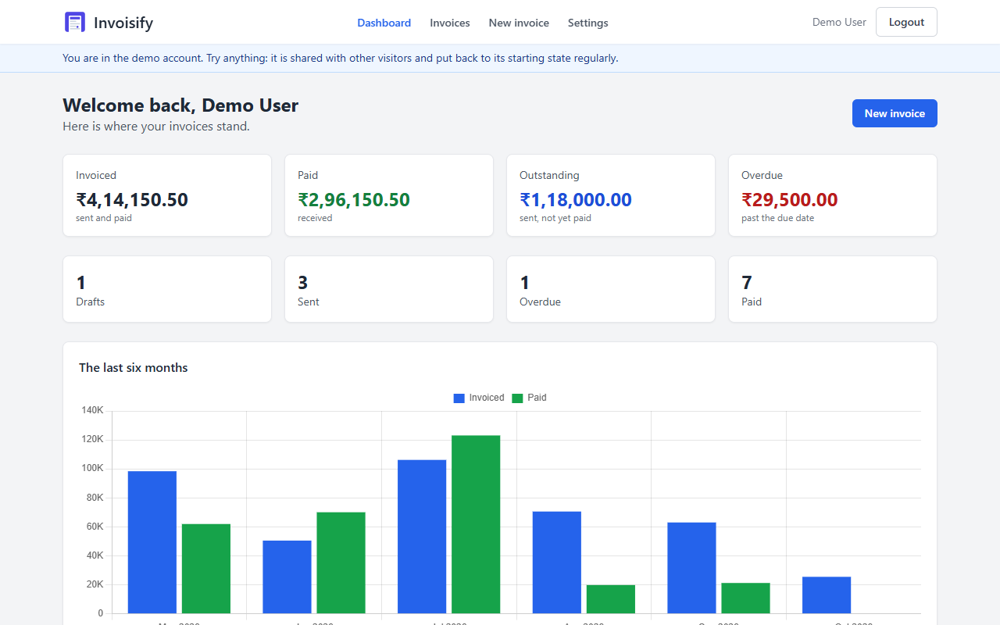
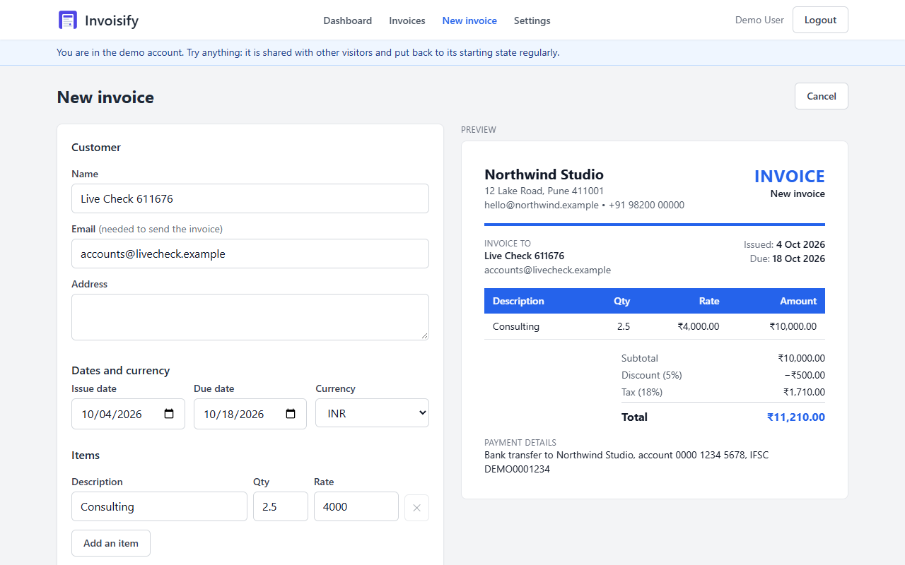
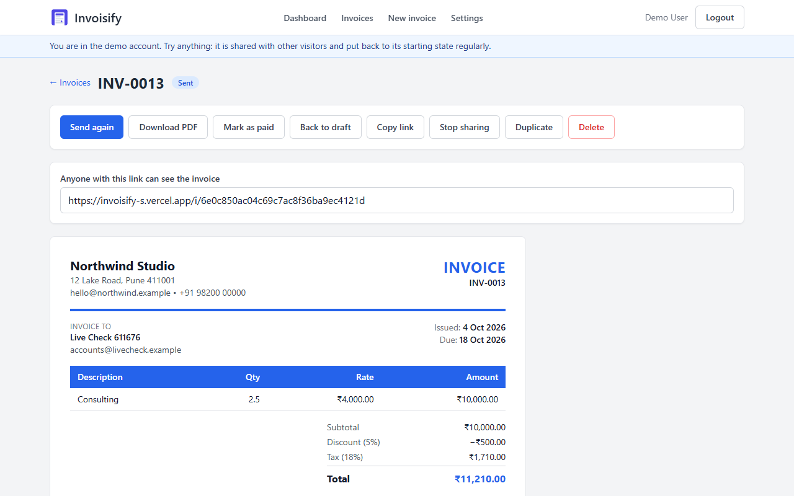
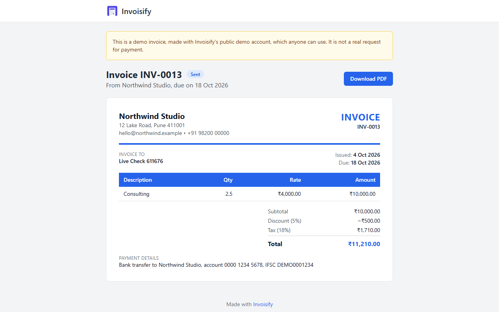
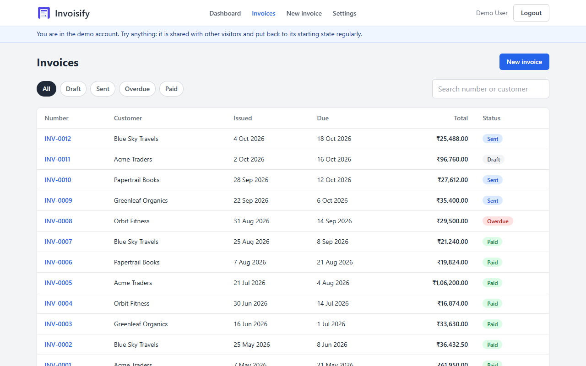
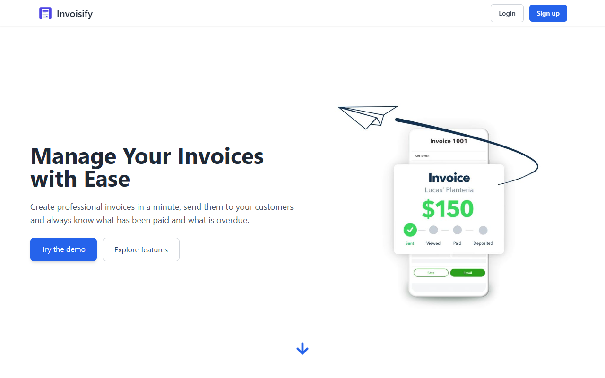

# Invoisify

Invoisify lets a freelancer or a small business create invoices, send them to
customers and see what has been paid.

**Live demo:** <https://invoisify-s.vercel.app> — use "Try the demo account"
on the login page. The first request after a quiet spell can take up to a
minute, while the server wakes up.

We started it as a personal project in December 2024 and completed it
afterwards. [docs/design.md](docs/design.md) describes the design.

## Screenshots

| | |
|---|---|
|  |  |
|  |  |
|  |  |

## What it does

- **Invoices**: numbered for you (INV-0001, INV-0002, …), with items, a
  discount, tax and a currency. Create, edit a draft, duplicate, delete, and
  move through draft → sent → paid. An invoice that is past its due date
  shows as overdue.
- **Exact totals**: the server calculates every amount in whole hundredths,
  so 0.1 × 3 is 0.30 and never 0.30000000000000004.
- **Send by email**: the customer gets a link to a read-only page of the
  invoice, where they can read it and download it as a PDF. You can also
  copy the link yourself, and stop sharing at any time.
- **Dashboard**: what you invoiced, what was paid, what is outstanding and
  overdue, a chart of the last six months, and your latest invoices. Amounts
  in different currencies are never added together.
- **Business profile**: your company details, logo, colour, default currency
  and tax rate, and payment details, filled in once and printed on every
  invoice. An invoice that was sent keeps the details it was sent with.
- **Accounts**: email sign-up with a verification link, password reset, and
  a demo account.
- **Reviews**: verified users can leave one review, shown on the landing
  page.

## Demo account

The login page has a "Try the demo account" button. The demo is a small
design studio with twelve invoices in every state.

The demo account is open to everyone, so it is fenced in:

- It sends no email: "Send" marks the invoice as sent and gives you its link.
  The public page of a demo invoice says that it is not a real request for
  payment.
- It stores no files, cannot change its password and cannot post a review.
- It can hold fewer invoices than a real account.
- With `SEED_ON_START=true` it is rebuilt every time the server starts, which
  undoes whatever visitors did. Real accounts are not touched.

## Tech stack

| Part | Stack |
|---|---|
| Frontend | React 18, Vite, Tailwind CSS, Redux Toolkit, Chart.js, html2pdf.js |
| Backend | Node.js, Express, MongoDB with Mongoose, JSON Web Tokens, Nodemailer, Multer, Cloudinary |
| Tests | Jest, Supertest, in-memory MongoDB |

## Getting started

### Prerequisites

- Node.js 20 or newer
- A MongoDB connection string (local MongoDB or MongoDB Atlas)
- SMTP credentials or a Brevo API key, for the verification, reset and
  invoice emails
- Optional: a Cloudinary account, for logos

### Setup

```bash
cd backend
npm install
cp .env.example .env     # then fill in the values, see below

cd ../frontend
npm install
```

### Settings

`backend/.env`:

| Key | Purpose |
|---|---|
| `MONGODB_URI` | Database connection string |
| `PORT`, `SERVER_HOST` | Where the server listens (`3004`, `localhost`). On a host, `SERVER_HOST` is `0.0.0.0` and the host sets `PORT` |
| `FRONTEND_URL` | The address of the web app (`http://localhost:5178`). Links in emails point there |
| `ACCESS_TOKEN_SECRET` | A long random text; logins are signed with it. A login lasts 7 days |
| `NODE_ENV` | `production` on a host: the login cookie is then sent over https only |
| `MAIL_HOST`, `EMAIL_PORT`, `MAIL_USER`, `MAIL_PASS` | SMTP settings |
| `BREVO_API_KEY`, `MAIL_FROM` | Optional. Send email through the Brevo HTTPS API instead of SMTP |
| `CLOUDINARY_CLOUD_NAME`, `CLOUDINARY_API_KEY`, `CLOUDINARY_API_SECRET` | Optional. Without them everything works and logos are not stored |
| `SEED_ON_START` | `true` rebuilds the demo account every time the server starts |
| `BUSINESS_UTC_OFFSET_MINUTES` | Optional. How far the business day is from UTC, in minutes; `330` (India) by default. "Today" and "overdue" follow it |
| `DAILY_SEND_LIMIT` | Optional. Invoices one account may email in a day, default `20` |
| `DAILY_MAIL_LIMIT`, `DAILY_INVOICE_MAIL_LIMIT` | Optional. Mails the whole site may send in a day, default `250`, and how many of them may be invoices, default `150`: the rest is kept for verification and reset links |
| `MAX_INVOICES`, `MAX_DEMO_INVOICES` | Optional. Invoices an account may hold, default `2000`; the demo account `200` |
| `CONNECTION_IP_HEADER` | Optional. A header in which the host reports the caller's address and which a caller cannot set, for example `cf-connecting-ip` on Render |

The request limits have defaults that suit a small site. Each can be changed
with a setting of its own: `ACCOUNT_RATE_LIMIT`,
`ACCOUNT_CONNECTION_RATE_LIMIT`, `ACCOUNT_GUESS_RATE_LIMIT`,
`ACCOUNT_EMAIL_RATE_LIMIT`, `ACCOUNT_MAIL_RATE_LIMIT`, `RESEND_RATE_LIMIT`,
`WRITE_RATE_LIMIT`, `PUBLIC_RATE_LIMIT` and `PUBLIC_CONNECTION_RATE_LIMIT`.
`CORS_ORIGIN` names another origin that may call the server from a browser;
the web app itself needs none.

The web app needs no settings.

### Run

Start the server and the web app in two terminals:

```bash
cd backend
npm run dev
```

```bash
cd frontend
npm run dev
```

Open <http://localhost:5178>. The web app forwards `/api` to the server on
port 3004.

### Demo data

```bash
cd backend
npm run seed
```

This builds the demo account and its invoices. Running it again rebuilds
them and touches nothing else.

### Tests

```bash
cd backend
npm test
```

The tests start their own in-memory database. They never send email and never
store a file.

## How it is kept safe

- A user reaches only their own invoices and profile; another user's id
  answers "not found".
- The public page of an invoice has a long random address, shows that one
  invoice without the customer's email address, and exists only while the
  invoice is sent or paid. Moving an invoice back to draft ends its link for
  good. The page is not kept by caches and asks search engines not to list
  it. A page made with the demo account says so.
- Logins, sign-ups, password resets and verification links are limited per
  visitor, per account and per address the request really came from; wrong
  passwords from one place do not lock the owner out elsewhere.
- An account can email a limited number of invoices a day. The whole site
  sends a limited number of mails a day, and invoices can use only a part of
  it. The mail says that Invoisify delivers it for the sender and does not
  check who the sender is.
- A logo is recognised by its content, not by the type it claims.
- What a user typed is escaped in the emails the site sends.

## Deployment

The server and the web app are deployed separately.

- **Server**: any Node.js host. Set the settings above, with
  `SERVER_HOST=0.0.0.0`, `NODE_ENV=production`, `FRONTEND_URL` pointing at
  the web app and `SEED_ON_START=true` for a public demo. The start command
  is `npm start` in `backend`. On hosts that block SMTP ports, use
  `BREVO_API_KEY`. On Render, also set
  `CONNECTION_IP_HEADER=cf-connecting-ip`.
- **Web app**: a static build of `frontend` (`npm run build`).
  `frontend/vercel.json` forwards `/api` to the server, so the login cookie
  stays on the web app's own address; put the server's address there.

## API

Every route is under `/api/v1` and answers
`{ statusCode, data, message, success }`. The login is kept in an httpOnly
cookie.

| Route | Who | Purpose |
|---|---|---|
| `GET /health` | everyone | The server is up |
| `POST /users/register`, `POST /users/login`, `POST /users/demo-login` | everyone | Accounts |
| `POST /users/forgot-password`, `GET /verify/verify-email`, `GET /verify/reset-password`, `POST /verify/reset-password` | everyone | Verification and password reset |
| `GET /users/me`, `POST /users/logout`, `POST /users/resend-verification`, `POST /users/change-password` | logged in | The session |
| `GET /business`, `PUT /business` | logged in | Business profile (logo as form field `logo`) |
| `GET /invoices`, `POST /invoices` | logged in | List (`page`, `search`, `status`) and create |
| `GET /invoices/:id`, `PUT /invoices/:id`, `DELETE /invoices/:id` | logged in | One invoice |
| `POST /invoices/:id/duplicate` | logged in | A new draft from it |
| `PATCH /invoices/:id/status` | logged in | `{ status, paidDate }` |
| `POST /invoices/:id/send` | logged in | Email it to the customer |
| `POST /invoices/:id/share`, `DELETE /invoices/:id/share` | logged in | The public link, and stopping it |
| `GET /public/invoices/:code` | everyone with the link | The public page's invoice |
| `GET /dashboard` | logged in | The figures |
| `GET /reviews` | everyone | Reviews and their average |
| `GET /reviews/mine`, `PUT /reviews/mine`, `DELETE /reviews/mine` | logged in | One's own review |

Changing anything needs a verified email address.

## Project structure

```
backend/
  src/
    app.js, index.js    Express app and start-up
    controllers/        Accounts, business, invoices, sharing, dashboard, reviews
    middlewares/        Login, uploads, request limits
    models/             User, Business, Invoice, Counter, Review, Usage
    routes/
    scripts/            The demo account's data
    utils/              Totals, invoice numbers, the business day, mail, limits
  tests/
frontend/
  src/
    api/                Requests to the server
    components/         The invoice as it looks on paper, session guards, shared pieces
    lib/                Amounts, formatting, PDF, messages
    pages/              Landing, accounts, dashboard, invoices, settings, public invoice
    redux/              Login state and on-screen messages
docs/
  design.md             Design of the app
```

## Team

Built by team Tech Forge: Samir Suroshe
([@samirsuroshe18](https://github.com/samirsuroshe18)), Tanishq Kulkarni
([@tanishqbuilds](https://github.com/tanishqbuilds)), Mohit Dhangar
([@mohit45v](https://github.com/mohit45v)) and Pranay Sanap
([@pranaysanap](https://github.com/pranaysanap)).

## License

[MIT](LICENSE)
